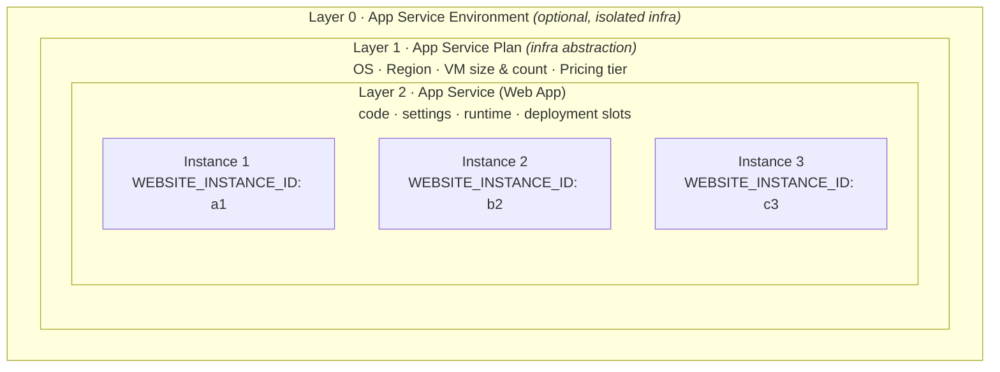

```mermaid
flowchart TB
    subgraph ASE["Layer 0 · App Service Environment <i>(optional, isolated infra)</i>"]
        subgraph PLAN["Layer 1 · App Service Plan <i>(infra abstraction)</i><br/>OS · Region · VM size &amp; count · Pricing tier"]
            subgraph APP["Layer 2 · App Service (Web App)<br/>code · settings · runtime · deployment slots"]
                I1["`Instance 1 WEBSITE_INSTANCE_ID: a1`"]
                I2["`Instance 2<br/>WEBSITE_INSTANCE_ID: b2`"]
                I3["`Instance 3<br/>WEBSITE_INSTANCE_ID: c3`"]
            end
        end
    end
```
