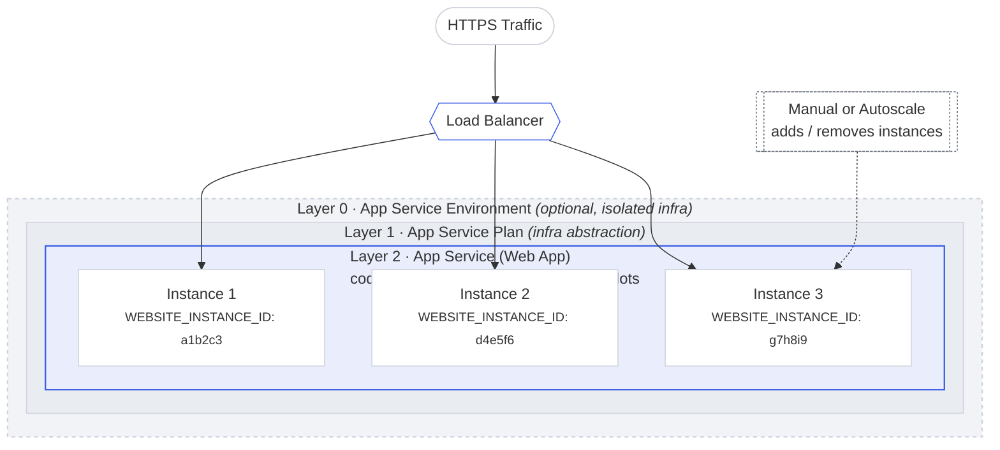

```mermaid
flowchart TB
    Traffic([HTTPS Traffic]) --> LB{{Load Balancer}}
    LB --> I1
    LB --> I2
    LB --> I3

    SCALE[["Manual or Autoscale<br/>adds / removes instances"]] -.-> I3

    subgraph ASE["Layer 0 · App Service Environment <i>(optional, isolated infra)</i>"]
        subgraph PLAN["Layer 1 · App Service Plan <i>(infra abstraction)</i><br/>OS · Region · VM size &amp; count · Pricing tier"]
            subgraph APP["Layer 2 · App Service (Web App)<br/>code · settings · runtime · deployment slots"]
                I1["Instance 1<br/><small>WEBSITE_INSTANCE_ID: a1b2c3</small>"]
                I2["Instance 2<br/><small>WEBSITE_INSTANCE_ID: d4e5f6</small>"]
                I3["Instance 3<br/><small>WEBSITE_INSTANCE_ID: g7h8i9</small>"]
            end
        end
    end

    style ASE fill:#f1f3f6,stroke:#cdd2db,stroke-dasharray: 4 4,stroke-width:1.5px
    style PLAN fill:#e9ecf1,stroke:#cdd2db,stroke-width:1px
    style APP fill:#eaeefc,stroke:#3559e6,stroke-width:1.5px
    style I1 fill:#ffffff,stroke:#cdd2db,stroke-width:1px
    style I2 fill:#ffffff,stroke:#cdd2db,stroke-width:1px
    style I3 fill:#ffffff,stroke:#cdd2db,stroke-width:1px
    style Traffic fill:#ffffff,stroke:#cdd2db
    style LB fill:#ffffff,stroke:#3559e6
    style SCALE fill:#ffffff,stroke:#5c6470,stroke-dasharray: 2 2
```
